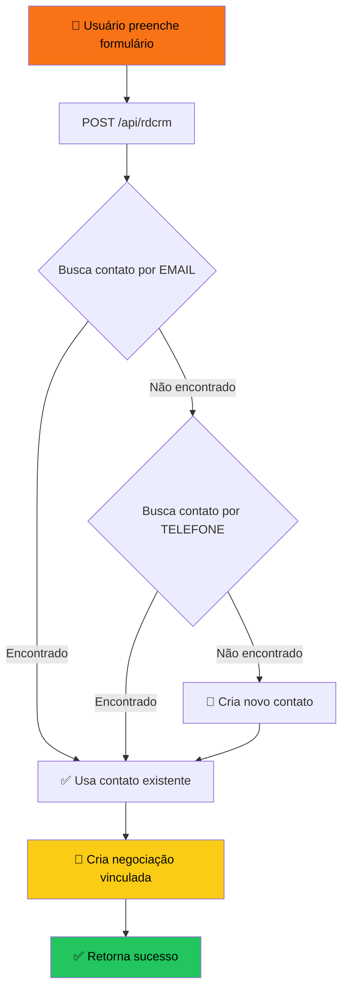

# 🥊 CT Porrada Terapia - Website

Site institucional do **CT Porrada Terapia**, um centro de treinamento de artes marciais localizado em Nova Iguaçu - RJ.


## 📋 Índice

- [Sobre o Projeto](#-sobre-o-projeto)
- [Funcionalidades](#-funcionalidades)
- [Tecnologias](#-tecnologias)
- [Estrutura do Projeto](#-estrutura-do-projeto)
- [Instalação](#-instalação)
- [Configuração](#-configuração)
- [Integração RD Station CRM](#-integração-rd-station-crm)
- [Deploy](#-deploy)

## 🎯 Sobre o Projeto

Website responsivo desenvolvido para o CT Porrada Terapia, oferecendo:

- Apresentação das modalidades (Muay Thai, Boxe, Judô, Kickboxing)
- Grade de horários interativa com filtro por modalidade
- Galeria de fotos com visualização em tela cheia
- Formulário de contato integrado ao RD Station CRM
- Design moderno com tema escuro e cores vibrantes

## ✨ Funcionalidades

### 🗓️ Grade de Horários

- Filtro por modalidade (Muay Thai, Boxe, Judô, etc.)
- Visualização organizada por dia e período (Manhã/Tarde/Noite)
- Fácil manutenção via código

### 🖼️ Galeria Interativa

- Clique para expandir imagem
- Navegação por setas (teclado ou clique)
- Fechamento por ESC ou clique fora

### 📝 Formulário de Contato

- Integração com RD Station CRM (API v1)
- Verificação de contato existente
- Criação automática de negociação

### 🎨 Design System

- Tema escuro com gradientes laranja/amarelo
- Scroll suave entre seções
- Scrollbar personalizada
- Totalmente responsivo

## 🛠️ Tecnologias

- **Framework:** Next.js 16 (App Router)
- **UI:** React 19 + TailwindCSS 4
- **Linguagem:** TypeScript
- **CRM:** RD Station CRM API v1
- **Deploy:** Vercel

## 📁 Estrutura do Projeto

```
src/
├── app/
│   ├── api/
│   │   └── rdcrm/          # API Route - Integração RD Station
│   │       └── route.ts
│   ├── globals.css         # Estilos globais + Design System
│   ├── layout.tsx          # Layout principal
│   └── page.tsx            # Página inicial
│
├── components/
│   ├── Header.tsx          # Navegação
│   ├── Hero.tsx            # Banner principal
│   ├── About.tsx           # Sobre o CT
│   ├── Schedule.tsx        # Grade de horários
│   ├── Gallery.tsx         # Galeria de fotos
│   ├── CTA.tsx             # Call to Action
│   ├── Contact.tsx         # Formulário de contato
│   └── Footer.tsx          # Rodapé
│
public/
├── banner/                 # Imagens de banner
├── photo/                  # Fotos gerais
└── logo/                   # Logos e favicons
```

## 🚀 Instalação

```bash
# Clone o repositório
git clone https://github.com/DiogoSis/site-porradaterapia.git

# Entre na pasta
cd site-porradaterapia/web

# Instale as dependências
npm install

# Rode o servidor de desenvolvimento
npm run dev
```

Acesse [http://localhost:3000](http://localhost:3000)

## ⚙️ Configuração

### Variáveis de Ambiente

Crie um arquivo `.env` na raiz do projeto:

```env
# Token de autenticação do RD Station CRM
RD_CRM_TOKEN=seu_token_aqui

# ID do funil de vendas (opcional)
RD_CRM_FUNIL=seu_funil_id_aqui
```

### Como obter o Token do RD Station CRM

1. Acesse o RD Station CRM
2. Vá em **Configurações > Integrações > Token de API**
3. Copie o token gerado

## 🔗 Integração RD Station CRM

O formulário de contato está integrado ao RD Station CRM via API v1.

### Fluxo da Integração



### Endpoints Utilizados

| Ação | Método | Endpoint |
|------|--------|----------|
| Buscar contato | GET | `/api/v1/contacts?token=X&email=Y` |
| Criar contato | POST | `/api/v1/contacts?token=X` |
| Criar negociação | POST | `/api/v1/deals?token=X` |

### Estrutura do Payload - Criar Contato

```json
{
  "contact": {
    "name": "Nome do Lead",
    "emails": [{ "email": "email@exemplo.com" }],
    "phones": [{ "phone": "21999999999", "type": "cellphone" }]
  }
}
```

### Estrutura do Payload - Criar Negociação

```json
{
  "deal": {
    "name": "Aula Experimental - Nome do Lead",
    "contacts_ids": ["id_do_contato"],
    "deal_pipeline_id": "id_do_funil"
  }
}
```

## 📅 Gerenciamento de Horários

Os horários são configurados diretamente no arquivo `src/components/Schedule.tsx`:

### Adicionar Nova Modalidade

```typescript
const MODALIDADES = [
  "Muay Thai",
  "Boxe",
  // Adicione aqui:
  "Nova Modalidade",
] as const;
```

### Adicionar Novo Horário

```typescript
const HORARIOS: ScheduleItem[] = [
  // Adicione um novo item:
  { 
    day: "Segunda-feira", 
    period: "Manhã", 
    time: "10:00 - 11:00", 
    type: "Nova Modalidade" 
  },
  // ...
];
```

## 🚢 Deploy

### Vercel (Recomendado)

1. Conecte o repositório ao [Vercel](https://vercel.com)
2. Configure as variáveis de ambiente
3. Deploy automático a cada push

### Variáveis de Ambiente no Vercel

```
RD_CRM_TOKEN=seu_token
RD_CRM_FUNIL=seu_funil_id
```

## 📄 Licença

Este projeto é privado e de uso exclusivo do CT Porrada Terapia.

---

Desenvolvido com 🔥 por [Diogo Sis](https://github.com/DiogoSis)
